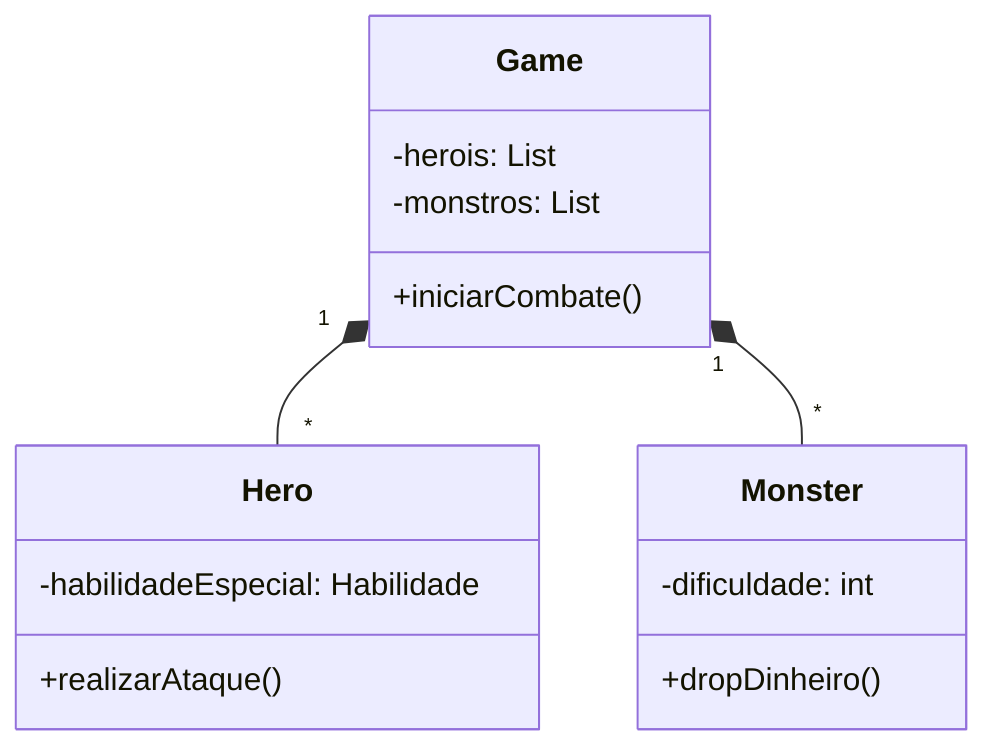

# trabalho_jogo_java

# 🐉 DungeonQuest: Text-Based RPG Adventure


**Um RPG tático em terminal com sistema de classes, combate estratégico e progressão de dificuldade**

---

## 🌟 Recursos Principais
- **4 Classes Únicas**: Guerreiro, Mago, Arqueiro e Furtivo com habilidades especiais
- **Sistema de Combate Dinâmico**: Críticos, esquivas, defesa e cálculo de dano contextual
- **IA Adaptativa**: Monstros com comportamentos distintos baseados na dificuldade
- **Economia Complexa**: Loja com poções, upgrades e moeda compartilhada
- **Chefes Desafiadores**: Inimigos únicos como o Leviatã com mecânicas especiais
- **Sistema de Logs**: Registro detalhado de todas as ações em batalha
- **Customização ANSI**: Cores e formatação para melhor experiência no terminal

---

## 🐄 Estrutura do Projeto

```plaintext
DungeonQuest/
│
├── src/                   # Código-fonte principal
│   ├── entities/         # Entidades do jogo
│   │   ├── heros/       # Heróis jogáveis (Classes e Habilidades)
│   │   ├── monsters/    # Inimigos e chefes
│   │   ├── Log.java     # Sistema de registro de eventos
│   │   └── Player.java  # Classe base para personagens
│   │
│   ├── Enums/            # Enumeradores
│   │   └── ResultadoAtaque.java  # Estados de ataque
│   │
│   ├── utils/            # Utilitários
│   │   ├── Cores.java    # Códigos ANSI para cores
│   │   └── Turno.java    # Lógica de turnos
│   │
│   ├── Game.java         # Classe principal (Controle do jogo)
│   └── InterfaceUsuario.java # Sistema de interação
│
├── docs/                 # Documentação técnica
│   ├── Design.md        # Arquitetura do sistema
│   ├── CombatRules.pdf  # Regras detalhadas de combate
│   └── UML_Diagram.pdf  # Diagrama de classes
│
├── assets/              # Recursos visuais
│   ├── ascii_art/      # Arte textual para cenários
│   └── icons/          # Ícones para menus
│
├── lib/                 # Dependências externas
├── LICENSE              # Licença MIT
└── README.md            # Este arquivo
```

## 🚀 Começando

### 🔧 Pré-requisitos
- Java JDK 17+ [(Download)](https://jdk.java.net/)
- Terminal moderno (Suporte a cores ANSI)
- 2GB RAM disponível
- Git (Opcional para instalação)

### 🛠️ Instalação

```bash
# Clone o repositório
git clone https://github.com/seu-usuario/DungeonQuest.git

# Acesse o diretório
cd DungeonQuest

# Compile o projeto (Windows/Linux/macOS)
javac src/*.java -d out/

# Execute o jogo
java -cp out/ Game
```

## 🎮 Como Jogar

### Fluxo Principal

#### Escolha de Dificuldade

```plaintext
[1] Fácil   - Monstros mais fracos (Recomendado para iniciantes)
[2] Médio   - Balanceado (Bom para jogadores experientes)
[3] Difícil - Inimigos com bônus de 50% (Desafio extremo)
```

### Gerenciamento de Grupo
- Verifique atributos dos heróis
- Compre itens na loja
- Gerencie equipamentos

### Combate Estratégico

```plaintext
Turno Herói:
[1] Atacar       - Dano básico (Força - Defesa inimiga)
[2] Habilidade   - Usar habilidade especial (Custo: MP)
[3] Item         - Usar poção/consumível
[4] Defender     - Reduz dano recebido no próximo turno
```

### Progressão
- Derrote monstros para ganhar ouro
- Enfrente o Leviatã quando estiver preparado
- Use o ouro para upgrades permanentes

---

## ⚔ Sistema de Combate

### Mecânicas Avançadas

#### Cálculo de Dano

```java
// Exemplo de cálculo crítico
int danoCritico = (forcaAtaque * 2) - defesaInimiga;
```

#### Tabela de Chances

| Dificuldade | Chance Crítico | Defesa Inimiga |
|-------------|--------------|---------------|
| Fácil       | 10%          | +0%           |
| Médio       | 15%          | +20%          |
| Difícil     | 20%          | +50%          |

#### Efeitos de Status

```plaintext
[Queimadura]   - 5% HP/turno por 3 turnos
[Sangramento]  - 3% HP/turno acumulativo
[Buff Ataque]  +30% dano físico
```

---

## 📚 Documentação Técnica

### Diagrama de Classes Simplificado



---

## 🎓 Licença
Distribuído sob licença MIT. Veja [LICENSE](LICENSE) para detalhes.

Desenvolvido com ☕ por [Seu Nome]
